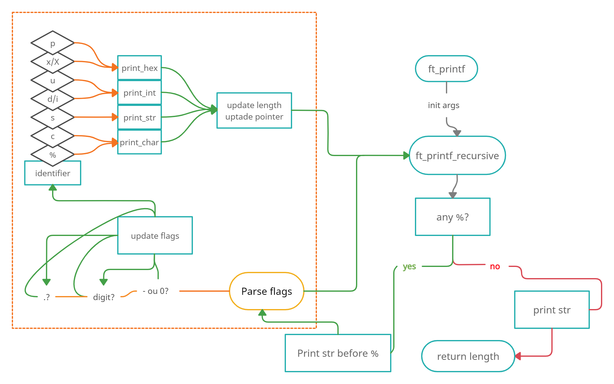
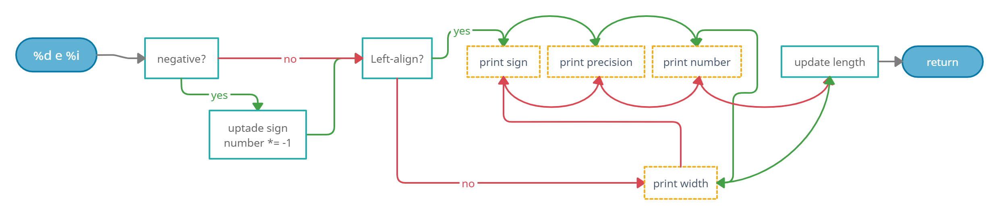
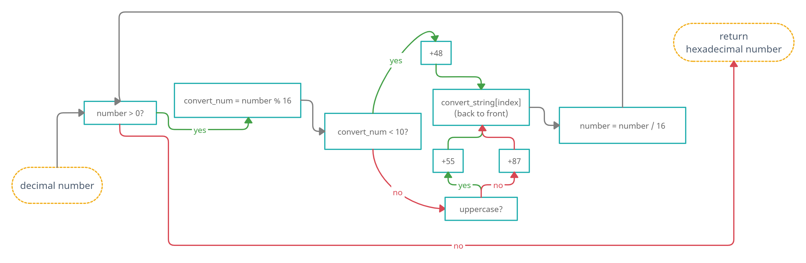

# ft_printf
 recode printf :astonished:

* [Introduction](#introduction)
* [Step by step](#step_by_step)
* [Mindmap](#mindmap) 
* [Study resources](#study)
* [Usage](#usage)
* [Testing](#tests) 

## introduction  

The versatility of the printf function in C represents a great exercise in programming for us. This [project](https://github.com/paulahemsi/ft_printf/blob/main/en.subject.pdf) is of moderate difficulty. It will enable you to discover variadic functions in C.
The key to a successful ft_printf is a well-structured and good extensible code.

## step_by_step

First of all, I wrote [this little program](./tests/understanding_printf_flags.c) just to understand the subject and printf's flags.

Those are the format identifier's I nedd to recode:

%  | type |
---|------|
%c | character				|
%s | string					|
%p | pointer				|
%d | decimal signed integer	|
%i | integer				|
%u | unsigned integer		|
%x | hex integer (lowercase)|
%X | hex integer (uppercase)|
%% | just the %				|

And those are the flags:

flag| ? |
----|---|
num	| (number between % and the identifier) minimum field width						|
'-' 	| left justify 																	|
'0' 	| field padded with 0's instead of blanks										|
'.' 	| precision															|
'*' 	| indicates that the maximum or minimum field width will be passed as parameter	|

**For %d and %i, the precision is the minimum number of digits to print.**

**For %s, the precision is the maximum field width.**

To be aware:

* flag '0' is ignored when flag '-' is present
* flag '0' is ignored when flag '.' is present (%d e %i)
* flag '0' results in undefined behavior with '%c', '%s' and '%p'
* flag '.' results in undefined behavior with '%c' and '%p'

(due my researches and empirical tests, 'undefined behavior' means the flags will be ignored, just as the '0' with '-')

>Format tags prototype is %|flags| |width| |.precision| |length| |specifier|

>The width specification never causes a value to be truncated. If the number of characters in the output value is greater than the specified width, or if width isn't provided, all characters of the value are output.

## mindmap

## %d and %i

## decimal to hexadecimal conversion

## study

* [printf overview](https://www.tutorialspoint.com/c_standard_library/c_function_printf.htm)
* [secrets of printf](https://www.cypress.com/file/54441/download)
* [variadic functions -intro](https://www.youtube.com/watch?v=FgvrnYScdH8)
* [va-arg](https://www.tutorialspoint.com/c_standard_library/c_macro_va_arg.htm)
* [layout of directories](http://syque.com/cstyle/ch7.1.htm)
* [format specification syntax](https://docs.microsoft.com/pt-br/cpp/c-runtime-library/format-specification-syntax-printf-and-wprintf-functions?view=msvc-160)
* [%p *versus* %x](https://www.viva64.com/en/k/0019/)
* [decimal to hex conversion](https://www.youtube.com/watch?v=QJW6qnfhC70)

## usage

clone this repository 
>git clone https://github.com/paulahemsi/ft_printf.git

and

comand | result |
---|------|
make | compile ftprintf library				|
make test | compile and run tests (edit your own test here)[tests/test.c]					|
make flags | compile and run printf flags example				|
make clean	| clean .o						|
make fclean| clean .o and .a				|

## tests
   
* [ft_printf_test](https://github.com/cacharle/ft_printf_test) by [Chacharle](https://github.com/cacharle)
* [PFT_EXAM](https://github.com/cclaude42/PFT_2019) by [César Claude](https://github.com/cclaude42)
* [42TESTERS-PRINTF](https://github.com/Mazoise/42TESTERS-PRINTF) by [Mazoise](https://github.com/Mazoise)

